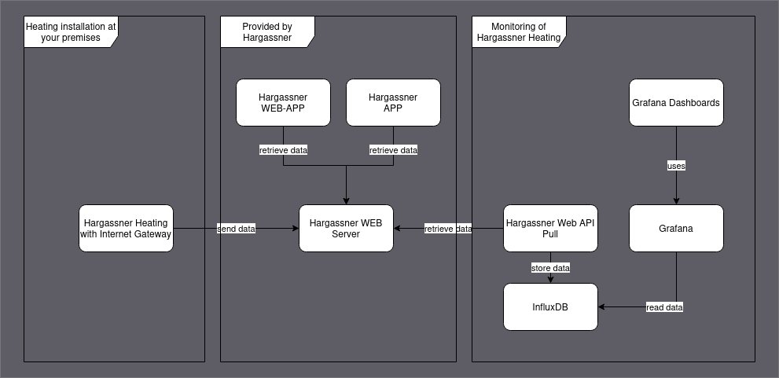

# hargassner-monitoring
Monitoring of Hargassner heating while pulling data from Hargassner Web-API.

## Features
* Pulls data from Hargassner Web-API
* Configuration of credentials for Hargassner Web-API or InfluxDB via YMAL configuraton file
* Extracts widget names and values automatically and stores them into InluxDB: The 
widget name serves as measurement name in InfluxDB and the installation information (ID, name, slug)
are used as tags.
* Maps state names to numerical values for persitance with InfluxDB, see [Status value mappings](#status-value-mappings)
* Verbose logging into rotating files (5 files, max 10 MB per file)
* Console log level can be configured via configuration file

# Preconditions

* Hargassner heating installation sends data vie its Internet Gateway to Hargassner
server __and__ you have an account for [Hargassner WEB-APP](https://web.hargassner.at) / APP.
* Required SW for pulling data:
  * [Python 3](https://www.python.org/)
  * [Poetry](https://python-poetry.org/)
  * [InfluxDB V2](https://www.influxdata.com/)

# Functional Building Blocks

* Hargassner heating installation with Internet Gateway sends data to Hargassner web service
* Python code  of `hargassner_web_api_pull` retrieves data and stores it into InfluxDB
* Data is visualized with Grafana Dashboards

# Usage

* Rename `config_template.yml` to `config.yml` and fill in required information
* Install dependencies with `poetry install`
* Execute:
  * Single run: execute `poetry run python hargassner_web_api_pull/hg_data_pull.py`
  * Run it in a shell-loop every two minutes: `./pull_data.sh`

## In case you get 401 during Hargassner login and you are sure that user / password are correct

To log into the Hargassner web API one also needs `client_id` and `client_secret`. This is configured
in `config.yml` and usually does not need to be changed. If you think you need to change it, follow
this procedure:

1. Open https://web.hargassner.at in browser
2. Open the network analysis console of the browser (F12 in Firefox, tab "Network analysis")
3. Log into the web application with your user / password
4. Find the `POST https://web.hargassner.at/api/auth/login` call in the trace
5. Switch to the `Request` tab, copy values from the variables `client_id` and `client_secret`

# Status value mappings

Defines the mapping of the state string values into numeric values for InfluxDB.

### Heating Boiler (Heizungskessel) states

| State name | German meaning | Numberic value |
| --- | --- | --- |
| STATE_OFF | Aus | 0 |
| STATE_IGNITION | Zündung | 1 |
| STATE_EFFICIENCY_FIRE | Leistungsbrand | 2 |
| STATE_DEASHING | Entaschung | 3 |

### Buffer (Pufferspeicher) states

| State name | German meaning | Numberic value |
| --- | --- | --- |
| STATE_CHARGING | Ladung Puffer | 10 |
| STATE_ON | ?? | 11 |

### Heating Circuit (Heizkreis) states

| State name | German meaning | Numberic value |
| --- | --- | --- |
| STATE_OFF | Aus | 0 |
| STATE_HEATING | Heizen | 20 |
| STATE_REDUCTION_TRANSITION | Absenken Rampe | 21 |

### Boiler (Heißwasserspeicher) states

| State name | German meaning | Numberic value |
| --- | --- | --- |
| STATE_OFF | Aus | 0 |

