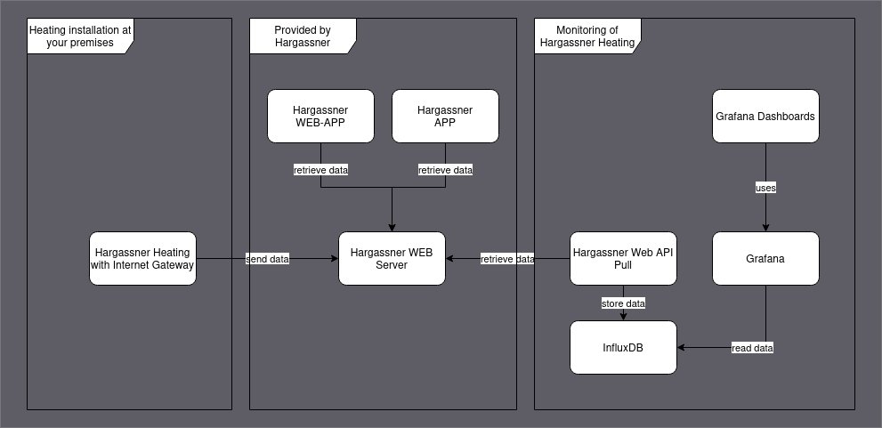

# hargassner-monitoring
Monitoring of Hargassner heating while pulling data from Hargassner Web-API.

# Preconditions

* Data of your Hargassner heating installation has to be send to Hargassner via an 
Internet Gateway __AND__ you have to have an account for Hargassner WEB-APP / APP.
* Have [Required SW](#required-sw) installed.
* Access to an InfluxDB instance.

# System Deployment

* Hargassner heating installation with Internet Gateway sends data to Hargassner web service
* Python code  of `hargassner_web_api_pull` retrieves data and stores it into InfluxDB
* Data is visualized with Grafana Dashboards

# Usage

* Rename `config_template.yml` to `config.yml` and fill in required information
* Install dependencies with `poetry install`
* Execute:
  * Single run: execute `poetry run python hargassner_web_api_pull/hg_data_pull.py`
  * Run it in a shell-loop every two minutes: `./pull_data.sh`

## In case you get 401 during Hargassner login and you are sure that user / password are correct

To log into the Hargassner web API one also needs `client_id` and `client_secret`. This is configured
in `config.yml` and usually does not need to be changed. If you think you need to change it, follow
this procedure:

1. Open https://web.hargassner.at in browser
2. Open the network analysis console of the browser (F12 in Firefox, tab "Network analysis")
3. Log into the web application with your user / password
4. Find the `POST https://web.hargassner.at/api/auth/login` call in the trace
5. Switch to the `Request` tab copy values from the variables `client_id` and `client_secret`

# Required SW

* Python 3
* Poetry
* InfluxDB V2: I used the [manual installation option](https://docs.influxdata.com/influxdb/v2/install/?t=Linux#manually-download-and-install-the-influxd-binary), for development. For production data
you should consider a different setup!

## InfluxDB

Configuration of development instance:

1. Start Influx DB
2. Open [Web-UI](http://localhost:8086) 
3. Create initial configuration with `user`, `password`, `org name`, `bucket name`
4. Save `Operator API Token` for later use.

## Poetry

Refer to [documentation for basic Poetry usage](https://python-poetry.org/docs/basic-usage/)

# Status value mappings

Defines the mapping of the string values for the status into numeric values for InfluxDB

### Heating Boiler (Heizungskessel) states

| State name | German meaning | Numberic value |
| --- | --- | --- |
| STATE_OFF | Aus | 0 |
| STATE_IGNITION | Zündung | 1 |
| STATE_EFFICIENCY_FIRE | Leistungsbrand | 2 |
| STATE_DEASHING | Entaschung | 3 |

### Buffer (Pufferspeicher) states

| State name | German meaning | Numberic value |
| --- | --- | --- |
| STATE_CHARGING | Ladung Puffer | 10 |
| STATE_ON | ?? | 11 |

### Heating Circuit (Heizkreis) states

| State name | German meaning | Numberic value |
| --- | --- | --- |
| STATE_OFF | Aus | 0 |
| STATE_HEATING | Heizen | 20 |
| STATE_REDUCTION_TRANSITION | Absenken Rampe | 21 |

### Boiler (Heißwasserspeicher) states

| State name | German meaning | Numberic value |
| --- | --- | --- |
| STATE_OFF | Aus | 0 |

